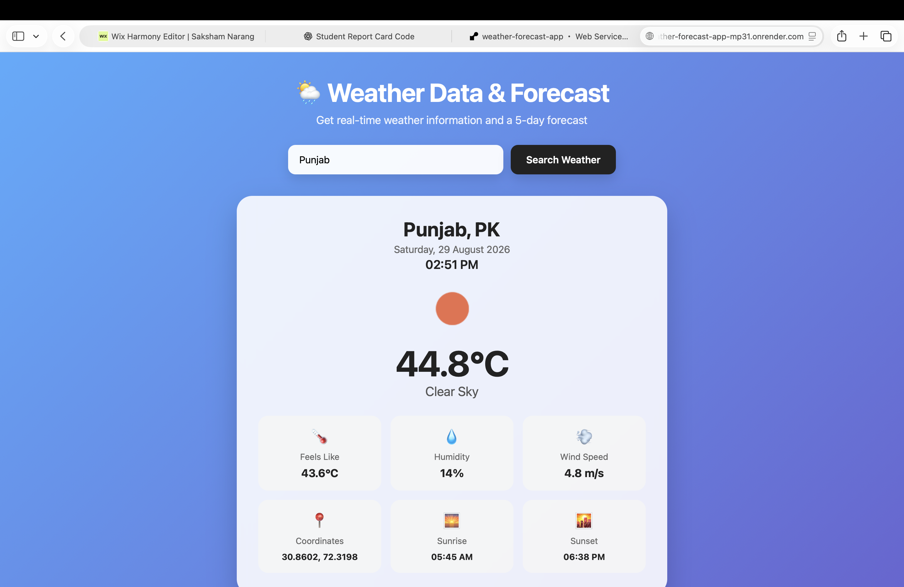
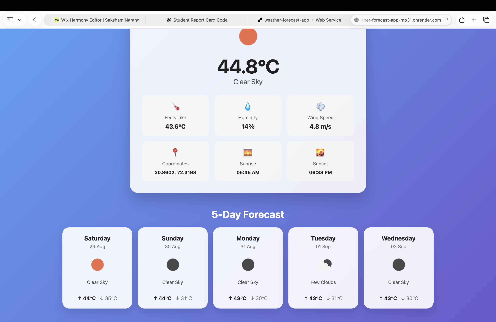

# 🌦️ Weather Data & Forecast App

A Flask-based weather application that provides real-time weather information and a 5-day weather forecast for any city.

## 🚀 Live Demo

[Open the Live Weather App](https://weather-forecast-app-mp31.onrender.com)

## ✨ Features

- 🌡️ Real-time temperature
- 🌤️ Current weather conditions
- 📅 5-day weather forecast
- 📈 Daily high and low temperatures
- 💧 Humidity information
- 💨 Wind speed
- 🌅 Sunrise and sunset times
- 📍 Geographic coordinates
- ❌ Error handling for invalid cities and API errors
- 📱 Responsive web interface

## 🛠️ Technologies Used

- Python
- Flask
- HTML
- CSS
- JavaScript
- OpenWeather API
- Requests
- python-dotenv
- Gunicorn

## 📸 Screenshots

### Weather Dashboard



### 5-Day Forecast



## 📁 Project Structure

```text
weather-forecast-app/
│
├── app.py
├── weather_app.py
├── requirements.txt
├── README.md
├── .gitignore
│
├── static/
│   └── style.css
│
└── templates/
    └── index.html


The OpenWeather API key is stored securely using an environment variable and is excluded from the GitHub repository using .gitignore.


👨‍💻 Author
Saksham Narang
Computer Science Engineering Student


⭐ Thanks for checking out this project!